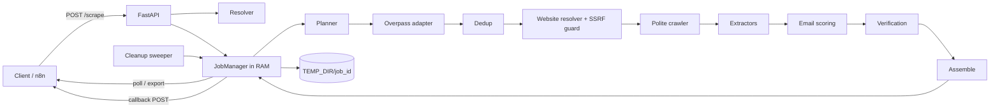

# Architecture

This document describes what v0.3 actually implements. The design rationale is in
`ARCHITECTURE.md`. Where the design was ambiguous, the decisions are recorded in `PLAN.md` §6
(referenced below as Q*/D*/E*).

## 1. Principles

- **Zero-config.**
  - There is no database, no Redis and no API key.
  - Paid APIs, LLMs and embeddings are not used.
  - Startup makes no outbound network call.
- **Ephemeral.**
  - Job state is a Python dict in one process.
  - Intermediate files go to `TEMP_DIR/{job_id}/`.
  - No company, email, DNS or verification data survives a job.
  - Only static reference data lives for the process lifetime: the CLDR country index, the
    industry catalog, config files, and the optional Nominatim geodata LRU cache.
- **Legal-notice-first.** Emails come from the company's own website (legal notice, contact page,
  JSON-LD).
- **Driven by `information`.** Extractors run only for fields the client asked for.
- **Single process.** Run exactly one Uvicorn worker. A restart loses all jobs, by design.

## 2. Data flow

```text
POST /scrape ──► resolve (sync; bad input → 422 before any job exists)
                   │
                   ▼  job created in RAM (scr_…), 202 returned
            ┌────────────── background asyncio task ────────────────────────────────┐
            │ plan        region × industry slices, over-fetch 1.5× (tier A/B) or 2× (C), │
            │             water-filling quota (domain/quota.py)                     │
            │ discover    one Overpass query per slice → candidates.jsonl           │
            │ dedup       registered domain; else name + postcode (token_set ≥ 92)  │
            │ website     normalise OSM website tag, drop social/directory sites,   │
            │             SSRF guard                                                 │
            │ crawl       homepage → legal/contact links (or fallback paths),       │
            │             robots.txt, politeness; HTML → crawl/                     │
            │ extract     emails, JSON-LD, phone, address, legal form, register,    │
            │             VAT, marketing objection (only requested fields)          │
            │ score       pick best email (config/i18n/role_emails.yaml)            │
            │ validate    drop objections (default), suppressed addresses, and      │
            │             low-confidence locations                                   │
            │ verify      optional (verify_emails): syntax + DNS; replace or drop   │
            │             unusable emails                                           │
            │ assemble    requested fields + country/region/industry labels as sent │
            │             → result.json; stop at max_output                         │
            └────────────────────────────────────────────────────────────────────────┘
                   │
                   ▼
   deliver: GET /scrape/{id} · ?wait · CSV export · callback_url
                   │
                   ▼
   cleanup: DELETE · callback 2xx · TTL → job + temp dir deleted, tombstone kept
```



Notes on behaviour:

- **Discovery is streamed.** Crawling and extraction start while discovery is still running,
  bounded by `CRAWLER_GLOBAL_CONCURRENCY`. The job stops early once `max_output` companies are
  accepted.
- **Quota is redistributed.** Each slice first gets an even share of the target. After all slices
  ran, the quota is re-allocated by real capacity, so a dense slice takes over what a sparse one
  could not fill.
- **Overlap rules.** A company matching several industries gets the most specific ISIC code. A
  company matching several regions gets the smallest area.
- **Region membership comes from the Overpass `area[...]` filter** (Q13). No polygon checks,
  no shapely.
- **Candidates without an own website are skipped.** An email can only come from a website.
- **Suppression always applies.** Addresses in `config/suppression.txt` are never returned, even
  with `verify_emails=false` (D1).
- **`verify_emails` never adds fields to the response** (Q15). It only filters and re-ranks.
- **Result can be smaller than `max_output`.** `count < max_output` is still `success` when the
  sources are exhausted or the per-job budget is reached.

## 3. Module map (`src/leadscraper/`)

| Path | Responsibility |
|---|---|
| `main.py` | App factory, lifespan (purge stale temp dirs, warm resolver index, start sweeper, clean shutdown) |
| `settings.py` | The environment variables of `.env.example` (and nothing else) |
| `constants.py` | All non-env limits and tunables (rate limits, Overpass gate, TTL helpers, max runtime, …) |
| `api/errors.py` | Uniform error envelope and exception handlers |
| `api/deps.py` | Optional API key (`X-API-Key` / `Bearer`), per-IP token-bucket rate limiter |
| `api/routes/scrape.py` | `/scrape`, `/scrape/resolve`, `/scrape/{id}`, export, DELETE |
| `api/routes/verify.py` | `/verify`, `/verify/{id}` |
| `api/routes/meta.py` | `/meta/countries`, `/meta/regions`, `/meta/industries` |
| `api/routes/health.py` | `/health`, `/metrics` |
| `schemas/` | Pydantic v2 request/response models (`scrape.py`, `verify.py`, `common.py`) |
| `domain/` | Pure code with no I/O: `models.py`, `quota.py` (water-filling), `tiling.py` (quadtree; not wired in v0.3) |
| `services/resolver/geo.py` | Country (ISO + all CLDR locales + aliases + conservative fuzzy) and region (ISO 3166-2 + aliases + fuzzy; optional Nominatim) |
| `services/resolver/profile.py` | `CountryProfile`: languages, postal patterns, contact keywords, tier, enabled sources |
| `services/resolver/industry.py` | Industry catalog (`data/isic/industries.yaml`, ISIC Rev.4) → `IndustryProfile` |
| `services/resolver/resolve.py` | Whole request → `resolved` block or `422` |
| `services/planner.py`, `services/dedup.py` | Slices/quota/over-fetch; deduplication and overlap rules |
| `services/scrape_service.py` | Pipeline orchestration |
| `services/verify_service.py` | Verification pipeline and scoring (`config/verification.yaml`) |
| `sources/base.py`, `registry.py`, `osm_overpass.py` | Adapter protocol; enabled adapters (v0.3: `osm` only); Overpass QL builder, gate, budget, retries |
| `sources/optional/` | Empty placeholder: Google Places and register adapters are planned for v1.0 |
| `crawler/website.py` | URL normalisation, social/directory filter, `HostGuard` SSRF check |
| `crawler/fetcher.py`, `robots.py`, `pages.py` | Polite fetcher, robots.txt cache, legal/contact page discovery |
| `extractors/` | `emails.py`, `jsonld.py`, `phone.py`, `address.py`, `legal.py`, `objection.py`, `scoring.py`, `text.py` |
| `verification/` | `syntax.py`, `dns.py`, `lists.py` (suppression, disposable, free-mail, role), `smtp.py`; vendored lists in `verification/data/` |
| `jobs/manager.py` | In-memory `JobState` store, ids, idempotency, temp dirs, tombstones |
| `jobs/cleanup.py` | TTL sweeper, max-runtime guard, callback-2xx deletion helper |
| `jobs/callback.py`, `jobs/bodies.py` | Callback delivery; final/failed body builders shared with GET |
| `observability/` | structlog JSON logging; Prometheus metrics |

Configuration data is in `config/`:
- `i18n/`: contact keywords, role emails, legal forms, objection patterns.
- `overrides/`: aliases, plus per-country overrides such as the `compliance_note`.
- `verification.yaml`: scoring weights.
- `suppression.txt`

The industry catalog is `data/isic/industries.yaml`. Both directories are copied into the image.

## 4. Job lifecycle and deletion rules

States: `queued → running → success | failed | cancelled`. Job ids are `scr_` (scrape) or `vrf_`
(verify) followed by 26 Crockford base32 characters.

| Event | Effect |
|---|---|
| Identical request body while the job is in RAM (not failed/cancelled) | Same `job_id` returned (idempotent) |
| Reading a result: final `GET` (paginated or not), `POST ?wait` returning `200`, CSV export | **Nothing is deleted** — results can be read/exported any number of times (T28, user request 2026-09-25, change of Q3). Remove a job with `DELETE`, or it expires by TTL (15 min after finishing, 30 min after failing). |
| Callback answered with `2xx` | Deleted immediately, tombstone kept |
| Callback non-2xx / timeout (10 s, single attempt) | Job stays pollable until its TTL. The job itself is not marked failed. |
| `DELETE /scrape/{id}` | Running task cancelled; job and temp dir deleted → `204` |
| `success` (read or not) | Deleted after `JOB_TTL_MINUTES` (default 15) — the safety net |
| `failed` | Deleted after `JOB_FAILED_TTL_MINUTES` (default 30), so the error can still be read |
| `cancelled` | Deleted at the next sweep (sweeper runs every 30 s) |
| Running longer than 120 min | Cancelled, `failed` with `job_timeout`, callback fires once, then failed-TTL |
| Service restart | All jobs lost; stale job dirs in `TEMP_DIR` purged at startup |

**Tombstones** contain only `job_id` and a deletion time. They expire after `JOB_TTL_MINUTES`.
They exist so a `DELETE` of a job already deleted by its callback still gets `204`.
A `GET` on a tombstoned id returns `404`.

A `failed` job's body is `{"status":"failed","job_id":…,"error":{code,message,details}}`. The
callback also fires for failed jobs. A job cancelled with `DELETE` never calls back.

Temp layout per job: `candidates.jsonl`, `crawl/` (fetched HTML), `result.json`. Cancelled,
failed and timed-out runs remove these files. In Docker, `TEMP_DIR` is a `tmpfs` mount.

## 5. Politeness and limits

| Area | Limit | Where |
|---|---|---|
| Overpass | 1 request in flight per process, 10/min, 100 per job, 5000/day in-process cap; 3 attempts with exponential backoff (10–60 s) on 429/502/503/504/timeout, then the slice is marked exhausted with a warning | `constants.py` |
| Overpass result | Capped at 5000 elements per query. A truncated slice is marked `saturated` and counted in `tiles_saturated_total`. | `constants.py` |
| Overpass query | One query per slice. It first collects the area's named elements (`nwr(area.region)["name"]->.named;`), then applies the keyword regex (whole-word for keywords under 8 characters), the negative-keyword filter and the OSM tag filters to that set. This returns the same elements as the A§4 example shape, but the public instance answers it far faster. Server timeout `[timeout:180]`; HTTP read timeout 240 s per request. | `sources/osm_overpass.py`, `constants.py` |
| Crawler | 1 connection per domain, `CRAWLER_PER_DOMAIN_DELAY_S` (2 s) between requests (raised to robots `Crawl-delay`, max 10 s), ≤ 5 pages per domain, bodies > 2 MB aborted, non-HTML skipped, robots.txt respected, User-Agent `CRAWLER_USER_AGENT` | env + `constants.py` |
| API | 120 requests/min per client IP, burst 30 → `429` + `Retry-After` (not applied to `/health` and `/metrics`) | `constants.py` |
| SMTP | Only via `/verify`, only when enabled; ≤ 2 connections per MX; never sends `DATA` | env + `constants.py` |

A 12-slice request takes about 70 s for discovery alone because of the Overpass gate. This was
accepted for v0.3 (Q-E13). A self-hosted Overpass (`OVERPASS_URL`) is still paced by the same
gate. That is a known limitation, and there is no env var to change it.

## 6. SSRF guard

Website URLs come from OSM tags, which anyone can edit. Before every request, including **every
redirect hop**, the crawler resolves the host and refuses any address that is not globally
routable: private, loopback, link-local/metadata, multicast, and IPv4-mapped equivalents. Only
`http`/`https` URLs are allowed, and at most 5 redirects are followed.

Known v0.3 limitation: the IP check and the connection are separate DNS lookups, so DNS
rebinding is not fully prevented.

Callback URLs are **not** filtered. They are supplied by the client, and pointing them at
internal hosts such as `http://n8n:5678` is the intended use.

## 7. Intentionally not included in v0.3

- PostgreSQL/PostGIS, Redis/Valkey, task queues, any persistent cache or history.
- Google Places, Companies House, commercial registers, paid geocoders, paid verification APIs,
  LLM or embedding industry mapping (all optional adapters for later versions).
- Playwright/JS rendering. Pages that need JavaScript yield nothing (planned for v0.4).
- Adaptive quadtree tiling. `domain/tiling.py` exists but is not wired in (v0.4).
- Local OSM/GeoNames extracts (v0.4). City/district regions only work with `NOMINATIM_URL`.
- Callback retries (v0.4), xlsx export, admin/suppression write endpoints.
- Multi-instance or multi-worker operation: state is per process.
