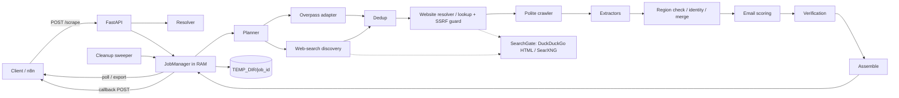

# Architecture

This document describes what the service actually implements: v0.3 plus the `PLAN.md` v0.4
"fast & fill" changes (speed, fill rate, website lookup, web-search discovery). The design
rationale is in `ARCHITECTURE.md`. Where the design was ambiguous, the decisions are recorded in
`PLAN.md` (referenced below as Q*/D*/E*/V*/CR*).

## 1. Principles

- **Zero-config.**
  - There is no database, no Redis and no API key.
  - Paid APIs, LLMs and embeddings are not used.
  - Startup makes no outbound network call.
- **Ephemeral.**
  - Job state is a Python dict in one process.
  - Intermediate files go to `TEMP_DIR/{job_id}/`.
  - No company, email, DNS or verification data survives a job.
  - Only static reference data lives for the process lifetime: the CLDR country index, the
    industry catalog, config files, and the optional Nominatim geodata LRU cache.
- **Legal-notice-first.** Emails come from the company's own website (legal notice, contact page,
  JSON-LD).
- **Driven by `information`.** Extractors run only for fields the client asked for.
- **Single process.** Run exactly one Uvicorn worker. A restart loses all jobs, by design.

## 2. Data flow

```text
POST /scrape ──► resolve (sync; bad input → 422 before any job exists)
                   │
                   ▼  job created in RAM (scr_…), 202 returned
            ┌────────────── background asyncio task ────────────────────────────────┐
            │ plan        region × industry slices (regions: [] → subdivisions when │
            │             the country has 1–40), over-fetch 1.5× (A/B) or 2× (C),   │
            │             water-filling quota (domain/quota.py)                     │
            │ discover    one Overpass query per slice, slices in parallel; one web │
            │             search per slice alongside (web_search) → candidates.jsonl│
            │ dedup       registered domain; else name + postcode (token_set ≥ 92)  │
            │ website     OSM website tag (social/directory dropped); else lookup:  │
            │             email domain → web search → guessed domain, each with an  │
            │             identity check; SSRF guard                                │
            │ crawl       homepage (www. flip) → legal/contact links, fallback per  │
            │             missing kind, sitemap; robots.txt, politeness, site budget│
            │             and early exit; HTML → crawl/                             │
            │ extract     emails, JSON-LD, phone, address, legal form, register,    │
            │             VAT, marketing objection (only requested fields)          │
            │ score       pick best email (config/i18n/role_emails.yaml)            │
            │ validate    region check (OSM area filter, or the company's own       │
            │             address for other sources), web-found companies' name and │
            │             industry rules, merge with OSM; drop objections (default) │
            │             and suppressed addresses                                  │
            │ verify      optional (verify_emails): syntax + DNS; replace or drop   │
            │             unusable emails                                           │
            │ assemble    requested fields + country/region/industry labels as sent │
            │             → result.json; stop at max_output                         │
            └────────────────────────────────────────────────────────────────────────┘
                   │
                   ▼
   deliver: GET /scrape/{id} · ?wait · CSV export · callback_url
                   │
                   ▼
   cleanup: DELETE · callback 2xx · TTL → job + temp dir deleted, tombstone kept
```



Notes on behaviour:

- **Discovery is streamed and parallel.** Slices run in parallel (up to the Overpass slots of all
  endpoints). Crawling and extraction start while discovery is still running: up to
  4 × `CRAWLER_GLOBAL_CONCURRENCY` (64) companies in flight, but only `CRAWLER_GLOBAL_CONCURRENCY`
  (16) connections. The job stops early once `max_output` companies are accepted and cancels the
  remaining work (including queued searches).
- **Only candidates with a website count toward the quota.** Each slice first gets an even share
  of the target, taken by candidates with a website (the OSM tag, or the OSM email domain). When
  the target is not met, top-up rounds follow in this order: the surplus of other slices, then
  web-found companies (further discovery queries only now), then the OSM companies without a
  website, whose website is searched for or guessed. At most 10 × `max_output` candidates are
  processed per job.
- **Overlap rules.** A company matching several industries gets the most specific ISIC code. A
  company matching several regions gets the smallest area.
- **Region membership** (V14a). OSM candidates are inside the area by the Overpass `area[...]`
  filter (Q13; no polygon checks, no shapely). Any other candidate needs the company's **own**
  address: the first address on its legal notice (footers excluded), else its JSON-LD
  `Organization` address. Its postcode must be one of the area's postcodes (a lazy, per-job
  Overpass area gazetteer, plus the postcodes of the job's OSM companies in that area); a
  postcode mismatch is final. Without a postcode, the city must be a gazetteer place (or, for a
  city-level area, the area's name). There is no bounding-box rule. A **country-level** area
  (`regions: []` for a country that is not split) gets **no gazetteer query** and relies on the
  OSM-candidate postcodes only. Postcodes are compared exactly after removing spaces, so a UK
  full postcode only matches OSM-candidate postcodes, not postcode-district boundaries.
- **Websites are looked up** (V10, V12, V13) for OSM companies without one: the OSM email's
  domain (not free-mail), then a web search for `"<name>" <city>` (plausible result domains only),
  then guessed domains (`name-slug.<tld>`, DNS first). A looked-up site must name the company and
  its location; for search and guess results the location must be the site's own address.
- **Web discovery** (V14b). One search per slice (`<industry keyword> <area name>`; the English
  country name for a whole-country slice) runs alongside Overpass; directory and social results
  are dropped before any crawl. A web-found company needs a legal name (legal notice or JSON-LD;
  the search title is never used) and an industry keyword on its home or legal page. The same
  domain as an OSM entry is one company (OSM wins); the same legal name + postcode as an OSM
  entry is either dropped (the OSM entry has a website or a record) or merged into it after an
  identity check.
- **JavaScript-only homepages are counted, not rendered** (`crawl_js_shells_total`, V15a).
- **Suppression always applies.** Addresses in `config/suppression.txt` are never returned, even
  with `verify_emails=false` (D1).
- **`verify_emails` never adds fields to the response** (Q15). It only filters and re-ranks.
- **Result can be smaller than `max_output`.** `count < max_output` is still `success` when the
  sources are exhausted or the per-job budget is reached.

## 3. Module map (`src/leadscraper/`)

| Path | Responsibility |
|---|---|
| `main.py` | App factory, lifespan (purge stale temp dirs, warm resolver index, start sweeper, clean shutdown) |
| `settings.py` | The environment variables of `.env.example` (and nothing else) |
| `constants.py` | All non-env limits and tunables (rate limits, Overpass gate, TTL helpers, max runtime, …) |
| `api/errors.py` | Uniform error envelope and exception handlers |
| `api/deps.py` | Optional API key (`X-API-Key` / `Bearer`), per-IP token-bucket rate limiter |
| `api/routes/scrape.py` | `/scrape`, `/scrape/resolve`, `/scrape/{id}`, export, DELETE |
| `api/routes/verify.py` | `/verify`, `/verify/{id}` |
| `api/routes/meta.py` | `/meta/countries`, `/meta/regions`, `/meta/industries` |
| `api/routes/health.py` | `/health`, `/metrics` |
| `schemas/` | Pydantic v2 request/response models (`scrape.py`, `verify.py`, `common.py`) |
| `domain/` | Pure code with no I/O: `models.py`, `quota.py` (water-filling), `tiling.py` (quadtree; not wired in v0.3) |
| `services/resolver/geo.py` | Country (ISO + all CLDR locales + aliases + conservative fuzzy) and region (ISO 3166-2 + aliases + fuzzy; optional Nominatim) |
| `services/resolver/profile.py` | `CountryProfile`: languages, postal patterns, contact keywords, tier, enabled sources |
| `services/resolver/industry.py` | Industry catalog (`data/isic/industries.yaml`, ISIC Rev.4) → `IndustryProfile` |
| `services/resolver/resolve.py` | Whole request → `resolved` block or `422` |
| `services/planner.py`, `services/dedup.py` | Slices/quota/over-fetch; deduplication and overlap rules |
| `services/scrape_service.py` | Pipeline orchestration (quota, top-up, website lookup, web pool, merge) |
| `services/website_lookup.py` | Website lookup: email domain, search guesses, domain guesses |
| `services/region_check.py` | Source-agnostic region check (rules, evidence, gazetteer types) |
| `services/verify_service.py` | Verification pipeline and scoring (`config/verification.yaml`) |
| `sources/base.py`, `registry.py`, `osm_overpass.py` | Adapter protocol; enabled adapters (`osm`, `web_search` unless `WEB_SEARCH_URL=off`); Overpass QL builder, gate pool, budget, failover, area gazetteer |
| `sources/web_search.py` | DuckDuckGo HTML / SearXNG backends, the process-wide `SearchGate`, the discovery adapter |
| `sources/optional/` | Empty placeholder: Google Places and register adapters are planned for v1.0 |
| `crawler/website.py` | URL normalisation, social/directory filter, `HostGuard` SSRF check |
| `crawler/fetcher.py`, `robots.py`, `pages.py` | Polite fetcher, robots.txt cache, legal/contact page discovery |
| `crawler/sitemap.py`, `crawler/js_shell.py` | Sitemap parsing; JavaScript app-shell detection |
| `extractors/` | `emails.py`, `page_emails.py`, `jsonld.py`, `phone.py`, `address.py`, `legal.py`, `identity.py`, `objection.py`, `scoring.py`, `text.py` |
| `verification/` | `syntax.py`, `dns.py`, `lists.py` (suppression, disposable, free-mail, role), `smtp.py`; vendored lists in `verification/data/` |
| `jobs/manager.py` | In-memory `JobState` store, ids, idempotency, temp dirs, tombstones |
| `jobs/cleanup.py` | TTL sweeper, max-runtime guard, callback-2xx deletion helper |
| `jobs/callback.py`, `jobs/bodies.py` | Callback delivery; final/failed body builders shared with GET |
| `observability/` | structlog JSON logging; Prometheus metrics |

Configuration data is in `config/`:
- `i18n/`: contact keywords, role emails, legal forms, objection patterns.
- `overrides/`: aliases, plus per-country overrides such as the `compliance_note`.
- `verification.yaml`: scoring weights.
- `suppression.txt`

The industry catalog is `data/isic/industries.yaml`. Both directories are copied into the image.

## 4. Job lifecycle and deletion rules

States: `queued → running → success | failed | cancelled`. Job ids are `scr_` (scrape) or `vrf_`
(verify) followed by 26 Crockford base32 characters.

| Event | Effect |
|---|---|
| Identical request body while the job is in RAM (not failed/cancelled) | Same `job_id` returned (idempotent) |
| Reading a result: final `GET` (paginated or not), `POST ?wait` returning `200`, CSV export | **Nothing is deleted** — results can be read/exported any number of times (T28, user request 2026-09-25, change of Q3). Remove a job with `DELETE`, or it expires by TTL (15 min after finishing, 30 min after failing). |
| Callback answered with `2xx` | Deleted immediately, tombstone kept |
| Callback non-2xx / timeout (10 s, single attempt) | Job stays pollable until its TTL. The job itself is not marked failed. |
| `DELETE /scrape/{id}` | Running task cancelled; job and temp dir deleted → `204` |
| `success` (read or not) | Deleted after `JOB_TTL_MINUTES` (default 15) — the safety net |
| `failed` | Deleted after `JOB_FAILED_TTL_MINUTES` (default 30), so the error can still be read |
| `cancelled` | Deleted at the next sweep (sweeper runs every 30 s) |
| Running longer than 120 min | Cancelled, `failed` with `job_timeout`, callback fires once, then failed-TTL |
| Service restart | All jobs lost; stale job dirs in `TEMP_DIR` purged at startup |

**Tombstones** contain only `job_id` and a deletion time. They expire after `JOB_TTL_MINUTES`.
They exist so a `DELETE` of a job already deleted by its callback still gets `204`.
A `GET` on a tombstoned id returns `404`.

A `failed` job's body is `{"status":"failed","job_id":…,"error":{code,message,details}}`. The
callback also fires for failed jobs. A job cancelled with `DELETE` never calls back.

Temp layout per job: `candidates.jsonl`, `crawl/` (fetched HTML), `result.json`. Cancelled,
failed and timed-out runs remove these files. In Docker, `TEMP_DIR` is a `tmpfs` mount.

## 5. Politeness and limits

| Area | Limit | Where |
|---|---|---|
| Overpass | Per endpoint: 2 requests in flight, 10/min, 5000/day in-process cap. 100 requests per job (the area gazetteer queries count too). At most 3 attempts per slice: with the public default `OVERPASS_URL` the next attempt goes to the next untried mirror (`overpass.kumi.systems`, `overpass.private.coffee`) without waiting; exponential backoff (10–60 s) only after every endpoint was tried; a `runtime error` remark fails over too, and the best partial answer is kept. Then the slice is marked exhausted with a warning naming the host. A self-hosted `OVERPASS_URL` never uses mirrors. | `constants.py` |
| Overpass result | Capped at 5000 elements per query. A truncated slice is marked `saturated` and counted in `tiles_saturated_total`. | `constants.py` |
| Overpass query | One query per slice. It first collects the area's named elements (`nwr(area.region)["name"]->.named;`), then applies the keyword regex (whole-word for keywords under 8 characters), the negative-keyword filter and the OSM tag filters to that set. This returns the same elements as the A§4 example shape, but the public instance answers it far faster. Server timeout `[timeout:180]`; HTTP read timeout 240 s per request. | `sources/osm_overpass.py`, `constants.py` |
| Crawler | 1 connection per domain, `CRAWLER_PER_DOMAIN_DELAY_S` (2 s) between requests (raised to robots `Crawl-delay`, max 10 s), ≤ 5 page requests per domain **including fallback-path probes and sitemap fetches**, bodies > 2 MB aborted, non-HTML skipped, robots.txt respected for every host (also looked-up, guessed and `www.`-flipped ones), User-Agent `CRAWLER_USER_AGENT`. Connections: `CRAWLER_GLOBAL_CONCURRENCY` (16) per job; companies in flight: 4 × that (64). Connect 5 s / read 10 s; 45 s per site; stop after 2 consecutive network failures. **Early exit:** when only `company_name`/`company_email`/`website` are requested and `verify_emails` is off, a site's crawl stops once a legal page shows a same-domain email that is not a special-function or suppressed address. Worst-case crawl memory: 64 companies × ≤ 5 pages × ≤ 2 MB ≈ 640 MB. | env + `constants.py` |
| Web search | 1 request in flight per process, ≥ 3 s apart, 60 per job (discovery ≤ 20), 1000/day; backend robots.txt read lazily (disallow → off for the process; unreadable → paused 15 min); HTTP 202/403/429 or a CAPTCHA page → paused 15 min; never Google/Bing; result URLs only fetched by the crawler | `constants.py`, `WEB_SEARCH_URL` |
| API | 120 requests/min per client IP, burst 30 → `429` + `Retry-After` (not applied to `/health` and `/metrics`) | `constants.py` |
| SMTP | Only via `/verify`, only when enabled; ≤ 2 connections per MX; never sends `DATA` | env + `constants.py` |

Overpass pacing is one query per 6 s per endpoint, so the last of 12 slices is queried after
about 70 s (Q-E13). Crawling starts with the first answer, and the job ends as soon as
`max_output` companies are accepted. A self-hosted Overpass (`OVERPASS_URL`) is still paced by
the same gate. That is a known limitation, and there is no env var to change it.

## 6. SSRF guard

Website URLs come from OSM tags, which anyone can edit. Before every request, including **every
redirect hop**, the crawler resolves the host and refuses any address that is not globally
routable: private, loopback, link-local/metadata, multicast, and IPv4-mapped equivalents. Only
`http`/`https` URLs are allowed, and at most 5 redirects are followed.

Known v0.3 limitation: the IP check and the connection are separate DNS lookups, so DNS
rebinding is not fully prevented.

Callback URLs are **not** filtered. They are supplied by the client, and pointing them at
internal hosts such as `http://n8n:5678` is the intended use.

## 7. Intentionally not included in v0.3

- PostgreSQL/PostGIS, Redis/Valkey, task queues, any persistent cache or history.
- Google Places, Companies House, commercial registers, paid geocoders, paid verification APIs,
  LLM or embedding industry mapping (all optional adapters for later versions).
- Search engines other than DuckDuckGo HTML and SearXNG; Google and Bing are rejected.
- Playwright/JS rendering. JavaScript-only homepages are detected and counted
  (`crawl_js_shells_total`) but yield nothing; a headless fallback is deferred (V15b).
- Challenge/CAPTCHA solving, User-Agent rotation or browser impersonation.
- Adaptive quadtree tiling. `domain/tiling.py` exists but is not wired in.
- Local OSM/GeoNames extracts. City/district regions only work with `NOMINATIM_URL`.
- Callback retries, xlsx export, admin/suppression write endpoints.
- Multi-instance or multi-worker operation: state is per process.
